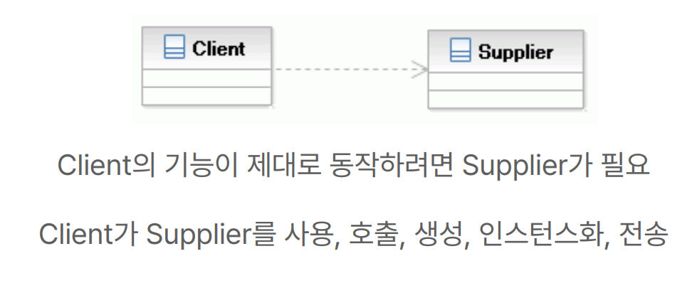
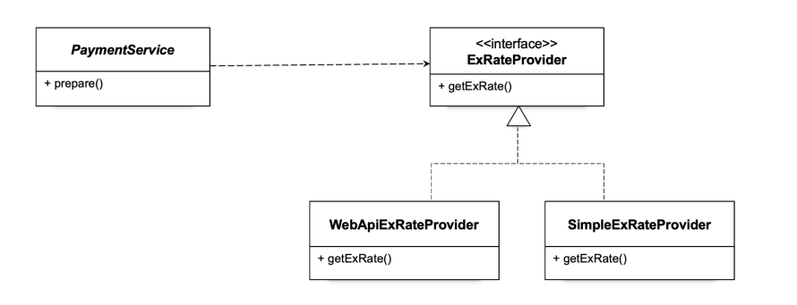
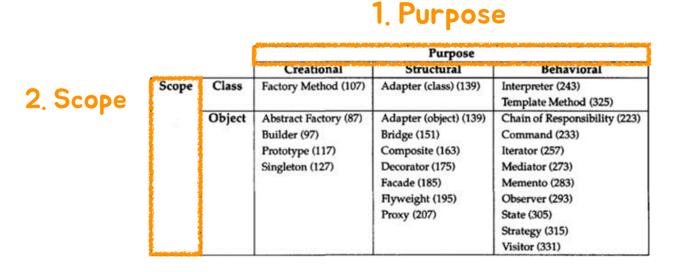
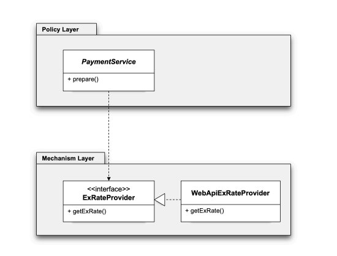

# 오브젝트와 의존관계

## 문서 관리자

조승효(문서 생성자)

## 클래스와 오브젝트

- 오브젝트는 실제로 우리가 프로그램을 실행하면 그때 만들어져서 그때 동작하는 무엇인가이다. 오브젝트가 일을 해서 기능을 수행함 -클래스는 오브젝트를 만들어내기 위해서 필요한 것 청사진 같은 것 -클래스의 인스턴스 = 오브젝트. 자바에서 오브젝트는 클래스의 인스턴스와 배열을 포함하는 말이다.

## 의존 관계(Dependency)

- 의존관계라고 하면 나하고 내가 아닌 다른 누군가 사이에 누가 누구를 의존하는 그런 관계
- A ---> B, A가 B에 의존한다.
- 의존관계가 있으려면 두개가 있어야 함
  
  

## 관심사의 분리(Separation of Concerns (SoC))

- 중요한 원리 중 하나
- 관심사가 다른 것은 분리해야 한다.
- 관심사는 변경이라는 관점으로 설명할 수 있다. 변경이 되는 시점이 다르면 관심사도 다르다
- 변경의 이유도 변경의 시점도 다른 코드를 같은 곳에 두는 것은 좋지 않다.
- 관심사를 분리하는 제일 쉬운 방법은 메소드를 분리하는 것
- 때로는 재사용성의 이유로 변경의 이유와 시점이 다른 코드를 밖으로 빼내야 할 필요가 있다. 확장성이 뛰어난 코드로 바꿀 필요가 있다. 상속을 이용하는 것도 하나의 방법
  
- 인터페이스를 도입해서 관심사를 분리할 수 있지 않을까?
  
- 관계설정 책임도 분리할 수 있어야 한다.
  
- 클라이언트가 가지고 있는 관심사를 분리하려면 다른 클래스 즉 오브젝트 팩토리를 만들 수도 있다.
  

## 원칙과 패턴

- 개방 폐쇄 원칙(Open-Closed Principle (OCP)): 클래스나 모듈은 확장에는 열려 있어야 하고 변경에는 닫혀 있어야 한다. 어떤 클래스는 이 클래스의 기능을 확장할 때 그 클래스의 코드는 변경되면 안된다. PaymentService 클래스는 일부 기능 환율 정보를 어떤 식으로 가져올 것인가라는 것을 확장시킬 수 있다. 하지만 확장할 때 PaymentService 코드 변경이 되지는 않는다.
- 높은 응집도와 낮은 결합도: 응집도가 높다는 것은 하나의 모듈이 하나의 책임 또는 관심사에 집중되어있다는 뜻. 변화가 일어날 때 해당 모듈에서 변하는 부분이 크다. 책임과 관심사가 다른 모듈과는 낮은 결합도, 즉 느슨하게 연결된 형태를 유지하는 것이 바람직하다.
- 전략 패턴: 자신의 기능 맥락에서 필요에 따라서 변경이 필요한 알고리즘을 인터페이스를 통해 통째로 외부로 분리시키고, 이를 구현한 구체적인 알고리즘 클래스를 필요에 따라 바꿔서 사용할 수 있게 하는 디자인 패턴
- 제어의 역전(Inversion of Control): 제어권 이전을 통한 제어관계 역전

## 싱글톤 레지스트리

- 싱글톤 레지스트리는 싱글톤 패턴의 구현 방식을 보완한 기능으로 직접 싱글톤 형태의 오브젝트를 만들고 관리하는 기능
- Bean 을 통해 주입을 받으면 비록 생성자를 호출하더라도 동일한 오브젝트가 나오게 된다.

## DI와 디자인 패턴

- Purpose: 패턴의 목적이 무엇이냐?
- Scope: 패턴을 Scope 관점에서 분리함 Class 패턴: 상속, Object 패턴: 합성
- 상속은 제약이 많기에 Object 합성 패턴이 권장됨
- 오브젝트 합성을 이용하는 디자인 패턴을 적용할 때 스프링의 의존관계 주입(Dependency Injection)을 사용함

## 의존성 역전 원칙(Dependency Inversion Principle)

- 상위 수준의 모듈은 하위 수준의 모듈에 의존해서는 안된다. 둘 모두 추상화에 의존해야 한다.
- 추상화는 구체적인 사항에 의존해서는 안 된다. 구체적인 사항은 추상화에 의존해야 한다.
- 모듈은 전체 시스템을 좀 작은 것으로 응집도가 높고 결합도가 낮은 단위로 나눈것. JAR로 끝나는 파일들이 일종의 모듈. 패키지가 모듈의 기준이 될 수도 있음.
  
- 상위 수준의 모듈은 정책과 같이 좀더 높은 수준, 하위 수준의 모듈은 메카니즘과 같이 좀더 낮은 수준. 일반적으로 의존관계는 상위에서 하위로 만들어지게 된다. 하지만 이건 좋지 않다. 하위 수준의 모듈이 변하게 되면 상위 수준의 모듈도 변해야 하기 때문이다.
  
- 이렇게 하는 것이 상위 수준의 모듈이 하위 수준의 모듈의 추상화에 의존한다는 것. 하지만 여전히 상위 수준의 모듈이 하위 수준의 모듈을 의존한다.
- 인터페이스 소유권의 역전이 필요하다. Separated Interface 패턴
- 인터페이스를 구현한 쪽으로 인터페이스를 위치시키는 것이 아니라 인터페이스를 사용하는 쪽으로 인터페이스를 위치시키자 이게 인터페이스 소유권의 역전
- 다시말해 의존성 역전 원칙은 인터페이스 소유를 구현하는 쪽이 아니라 사용하는 쪽으로 두라는 것?
