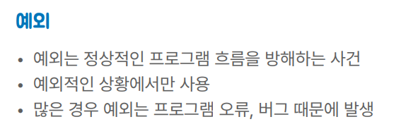
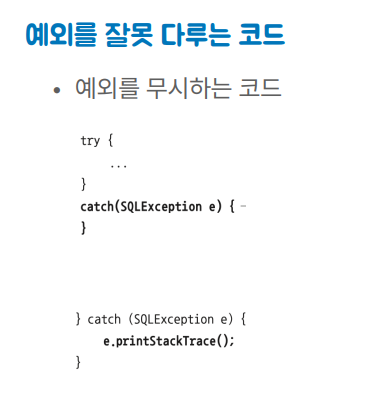
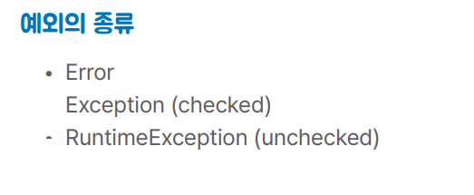
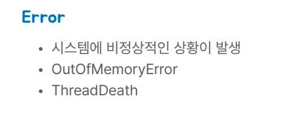
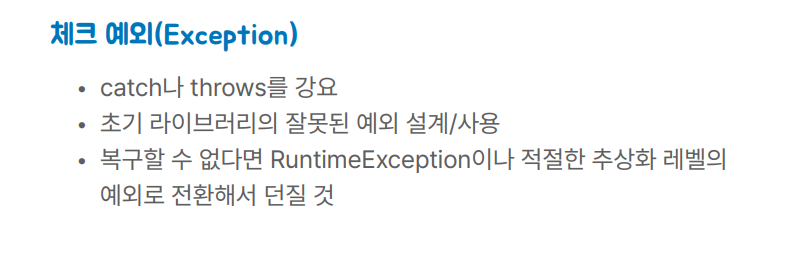
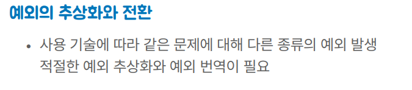
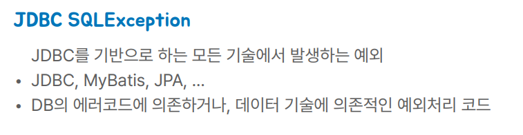
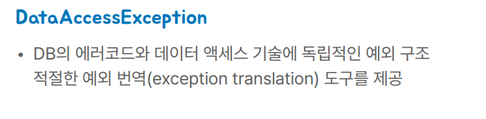

# 예외

## 문서 관리자

조승효(문서 생성자)

## 예외란

- 예외를 무시하면 안된다.
- 예외를 출력하기만 하는 것도 좋지 않다.

- 만약에 중복된 키를 저장하는 상황에서 예외가 발생한다면 어떻게 처리할 것인가? JPA, JDBC, Mybatis 등 던지는 예외가 같은 상황에서도 다를 수가 있는데 이럴 때 어떻게 할 것인가?

