# 서비스 추상화

## 문서 관리자

조승효(문서 생성자)

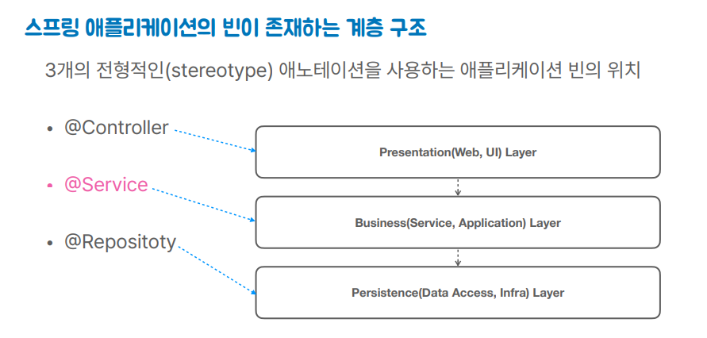

- 서비스는 일반적인 용어라서 쓰이는 곳에 따라 다른 의미를 가진다.
- 서비스는 클라이언트에게 서비스를 제공해주는 오브젝트나 모듈. 클라이언트가 반드시 존재해야 한다. 서버라고 불러도 된다.
- 서비스는 일반적으로 상태를 가지지 않음. 그래서 상태없는(stateless) 싱글톤 스프링 빈을 사용하기 적합함.
  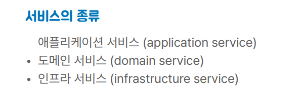
- 애플리케이션 서비스는 애플리케이션 계층에 존재해서 서비스라는 애노테이션이 붙는다. 비즈니스 로직을 담당함
- 도메인 서비스는 도메인 모델 패턴을 이용해서 비즈니스 로직을 엔티티 같은 도메인 오브젝트에 집어넣는 경우에 특정 엔티티로는 표현하기 힘든 로직을 도메인 서비스의 오브젝트에 넣어서 함.
- 인프라 서비스는 서비스 추상화의 대상이 되는 것. 도메인/애플리케이션 로직에 참여하지 않는, 기술을 제공하는 서비스 메일, 캐시, 트랜잭션, 메시징

## 애플리케이션 서비스 도입

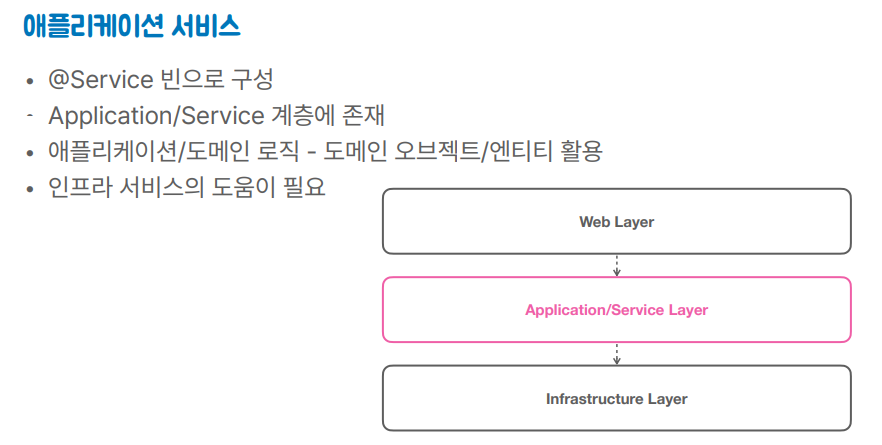
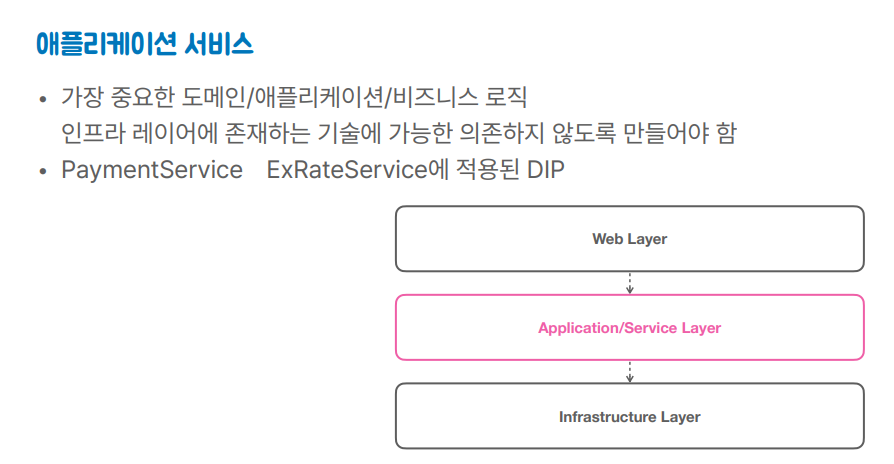

## 기술에 독립적인 애플리케이션 서비스

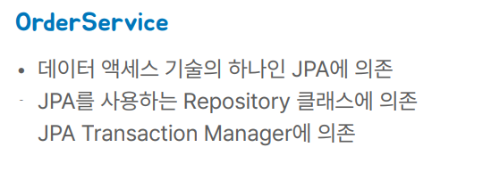
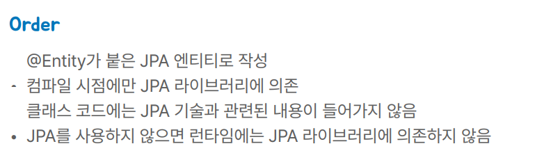
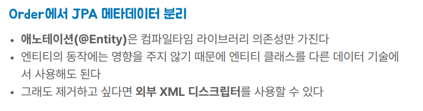
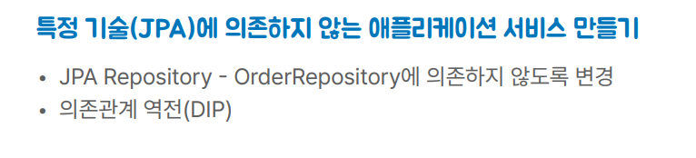

## 트랜잭션 서비스 추상화

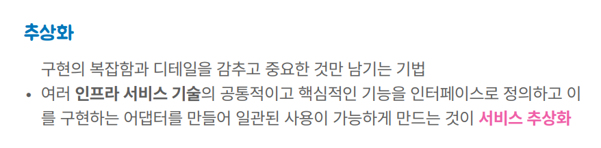

- 추상화는 공통적인 핵심 기능이 있어서 그걸 뽑아서 인터페이스로 만드는 것
- JPA Transaction, JDBC Transaction 은 라이브러리에 들어가 있는 것으로 이걸 직접 PlatformTransactionManager 로 변환할 수가 없다. 그래서 중간에 이걸 변환해주는 그런 과정이 하나 필요한데 그걸 어댑터라고 한다.
- 서비스 추상화의 예시: 플랫폼 트랜잭션 매니저라는 걸로 추상화해놓고 이거에 대한 각 기술별 어댑터를 다 제공해주고 있다.
- 공통적인 사용 방법을 제공해주는 것이 서비스 추상화(트랜잭션, 캐시등)

## JDBC 데이터 액세스 기술

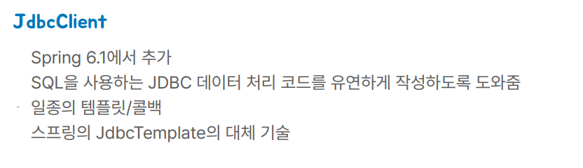
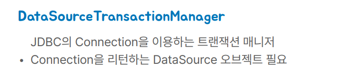

## 트랜잭션 프록시

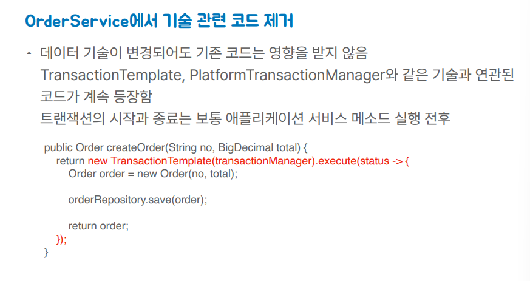
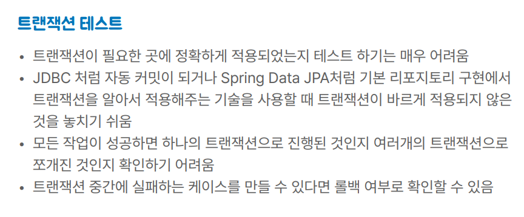
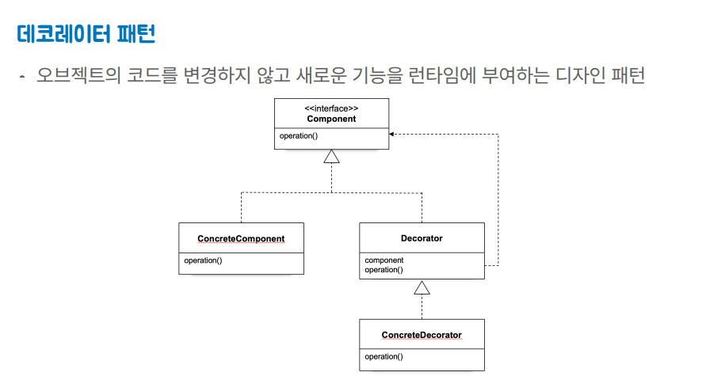

- 데코레이터 패턴은 사실 컴포지트 패턴과 유사하다.

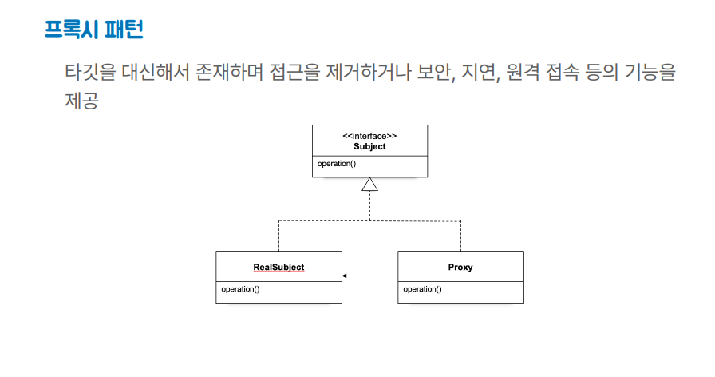
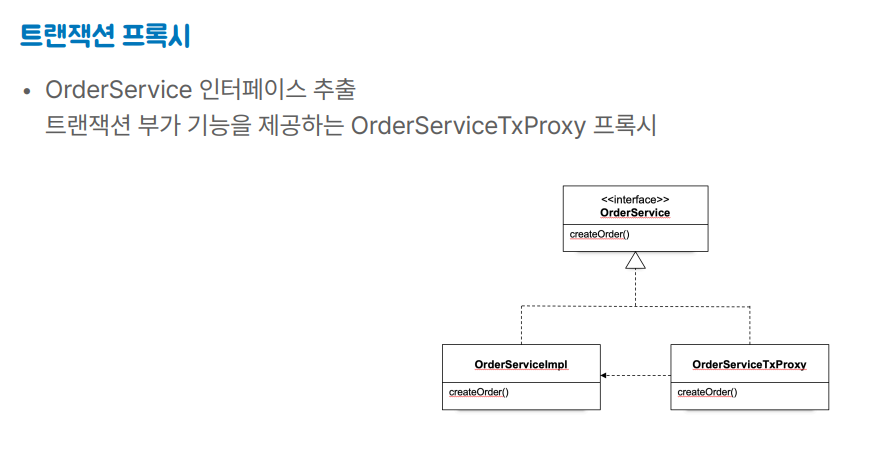
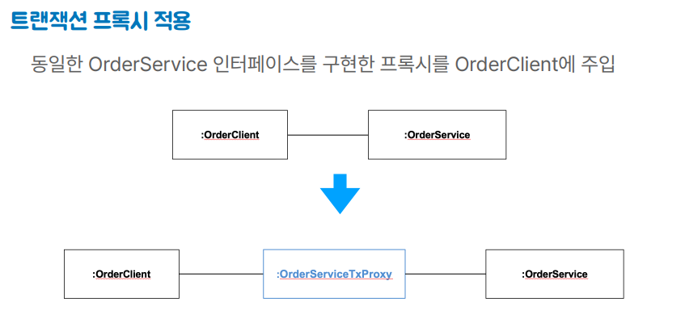
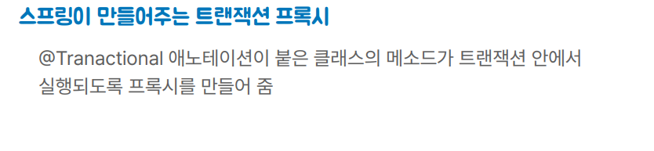
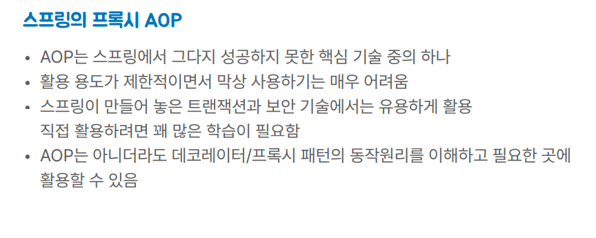
