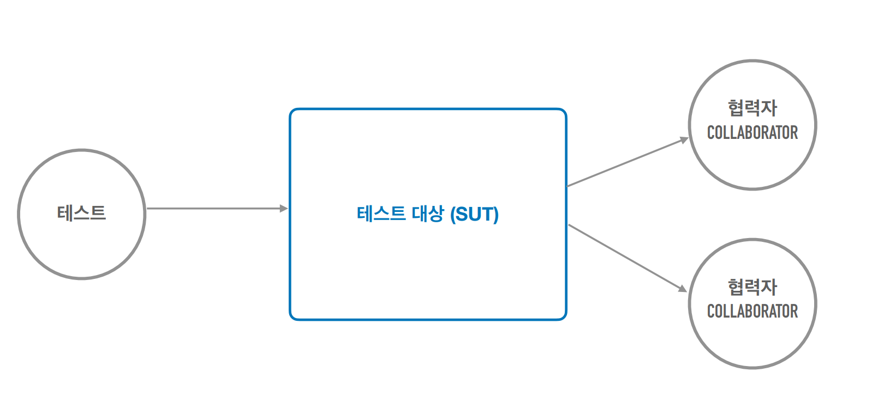
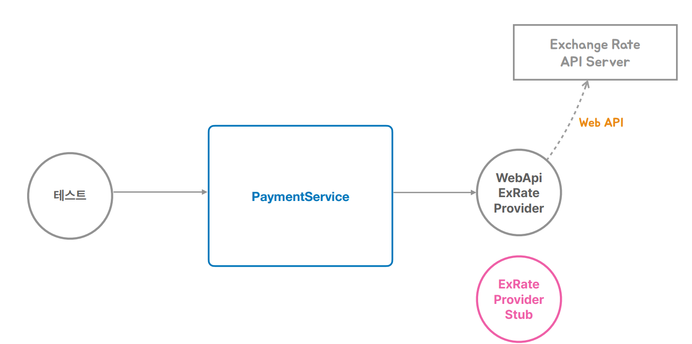
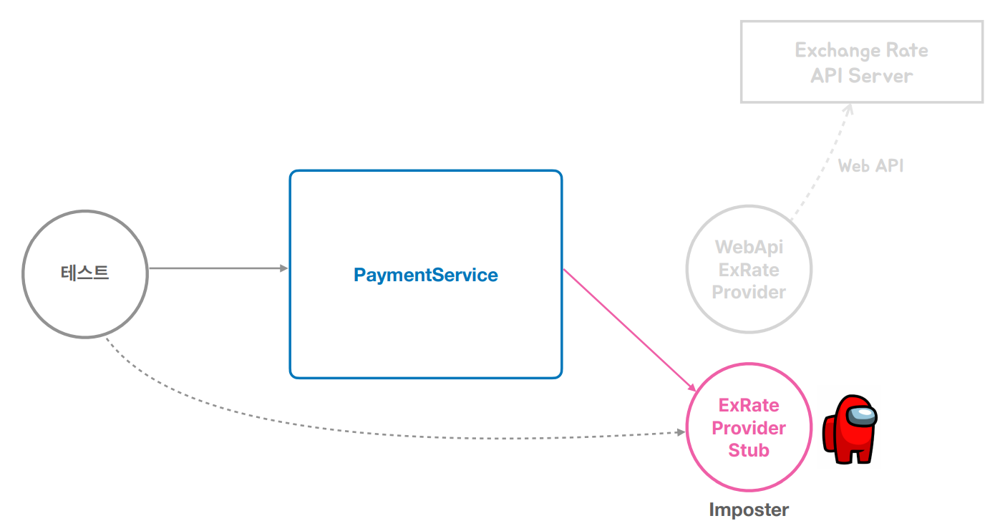

# 테스트

## 문서 관리자

조승효(문서 생성자)

## 테스트

- 테스트를 만들지 않을 거면 스프링을 도대체 뭐하러 쓰는 거죠?
- 수동 테스트의 한계: 프린트된 메시지를 수동으로 확인하는 방법은 불편하다. 사용자 웹 UI까지 개발한 뒤에 확인하는 방법은 테스트가 실패했을 때 확인할 코드가 많다. 테스트할 대상이 많아질수록 검증하는데 시간이 많이 걸리고 부정확함
- 그래서 가능하면 작은 크기의 자동 수행되는 테스트(Automated Test) 를 만들어라
- 개발자가 만드는 테스트: 개발한 코드에 대한 검증 기능을 코드로 작성한다. 자동으로 테스트를 수행하고 결과를 확인한다. 테스팅 프레임워크를 활용한다. 테스트 작성과 실행도 개발 과정의 일부이다.
- JUnit 을 할때 @Test 마다 SortTest 같은 객체가 새로 만들어지는 방식이다. 이유는 테스트마다 독립적으로 작동해야 하기 때문이다. 테스트 실행 순서에 따라 결과가 달라져서도 안되고 앞에 테스트에서 뭔가 남겨 놓은 거를 그 다음 테스트가 받는 것도 안된다. 매번 새로운 인스턴스를 만든다.
- JUnit 에 @DisplayName 이 있다는 것을 기억해두자.
  
  
- 스텁을 두어서 온전한 기능을 구현한 것은 아니지만 테스트 동안에만 돌아갈 수 있게 할 수 있다.
  

## 테스트와 DI

- 수동 DI를 이용하는 테스트: 테스트용 협력자(Collaborator) / 의존 오브젝트를 테스트 대상에 직접 주입하고 테스트
- 스프링 DI를 이용하는 테스트: 테스트용 협력자(Collaborator) / 의존 오브젝트를 스프링의 구성 정보를 이용해서 저장하고 컨테이너로부터 테스트 대상을 가져와서 테스트 @ContextConfiguration @Autowired
- 테스트에 한해서 인터페이스 대신 구현체를 직접 @Autowired 할 수 있다.
