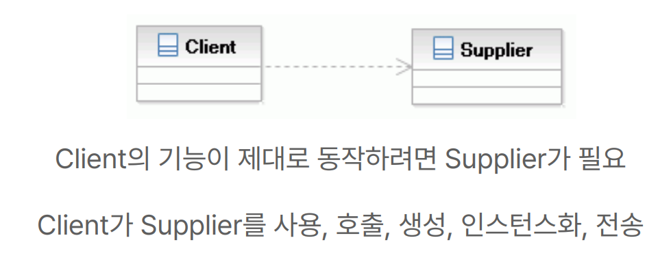
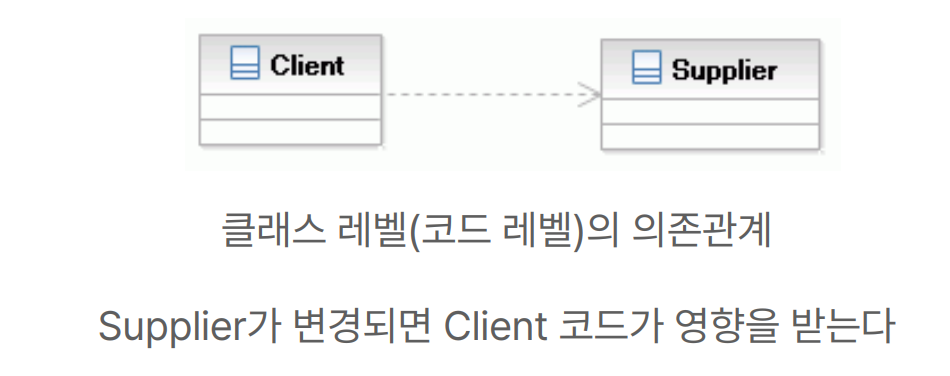
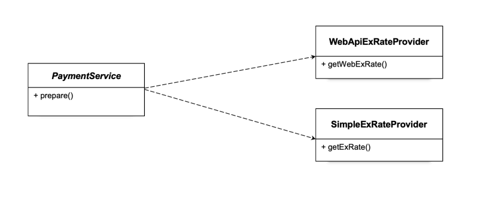
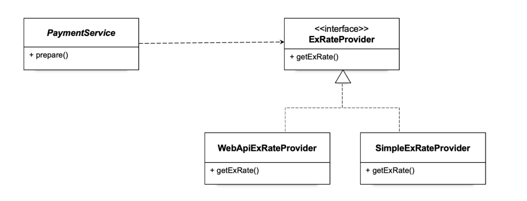
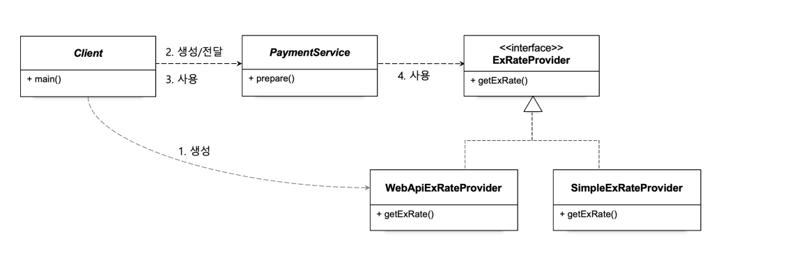
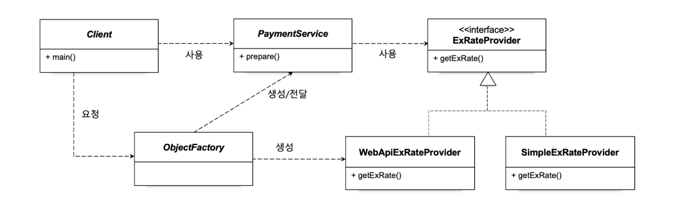

# 오브젝트와 의존관계

## 문서 관리자

조승효(문서 생성자)

## 클래스와 오브젝트

- 오브젝트는 실제로 우리가 프로그램을 실행하면 그때 만들어져서 그때 동작하는 무엇인가이다. 오브젝트가 일을 해서 기능을 수행함 -클래스는 오브젝트를 만들어내기 위해서 필요한 것 청사진 같은 것 -클래스의 인스턴스 = 오브젝트. 자바에서 오브젝트는 클래스의 인스턴스와 배열을 포함하는 말이다.

## 의존 관계(Dependency)

- 의존관계라고 하면 나하고 내가 아닌 다른 누군가 사이에 누가 누구를 의존하는 그런 관계
- A ---> B, A가 B에 의존한다.
- 의존관계가 있으려면 두개가 있어야 함
  
  

## 관심사의 분리(Separation of Concerns (SoC))

- 중요한 원리 중 하나
- 관심사가 다른 것은 분리해야 한다.
- 관심사는 변경이라는 관점으로 설명할 수 있다. 변경이 되는 시점이 다르면 관심사도 다르다
- 변경의 이유도 변경의 시점도 다른 코드를 같은 곳에 두는 것은 좋지 않다.
- 관심사를 분리하는 제일 쉬운 방법은 메소드를 분리하는 것
- 때로는 재사용성의 이유로 변경의 이유와 시점이 다른 코드를 밖으로 빼내야 할 필요가 있다. 확장성이 뛰어난 코드로 바꿀 필요가 있다. 상속을 이용하는 것도 하나의 방법
  
- 인터페이스를 도입해서 관심사를 분리할 수 있지 않을까?
  
- 관계설정 책임도 분리할 수 있어야 한다.
  
- 클라이언트가 가지고 있는 관심사를 분리하려면 다른 클래스 즉 오브젝트 팩토리를 만들 수도 있다.
  

## 원칙과 패턴

- 개방 폐쇄 원칙(Open-Closed Principle (OCP)): 클래스나 모듈은 확장에는 열려 있어야 하고 변경에는 닫혀 있어야 한다. 어떤 클래스는 이 클래스의 기능을 확장할 때 그 클래스의 코드는 변경되면 안된다. PaymentService 클래스는 일부 기능 환율 정보를 어떤 식으로 가져올 것인가라는 것을 확장시킬 수 있다. 하지만 확장할 때 PaymentService 코드 변경이 되지는 않는다.
- 높은 응집도와 낮은 결합도: 응집도가 높다는 것은 하나의 모듈이 하나의 책임 또는 관심사에 집중되어있다는 뜻. 변화가 일어날 때 해당 모듈에서 변하는 부분이 크다. 책임과 관심사가 다른 모듈과는 낮은 결합도, 즉 느슨하게 연결된 형태를 유지하는 것이 바람직하다.
- 전략 패턴: 자신의 기능 맥락에서 필요에 따라서 변경이 필요한 알고리즘을 인터페이스를 통해 통째로 외부로 분리시키고, 이를 구현한 구체적인 알고리즘 클래스를 필요에 따라 바꿔서 사용할 수 있게 하는 디자인 패턴
- 제어의 역전(Inversion of Control): 제어권 이전을 통한 제어관계 역전
