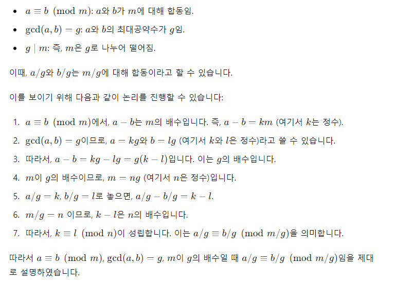
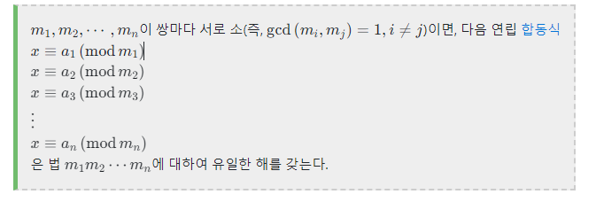
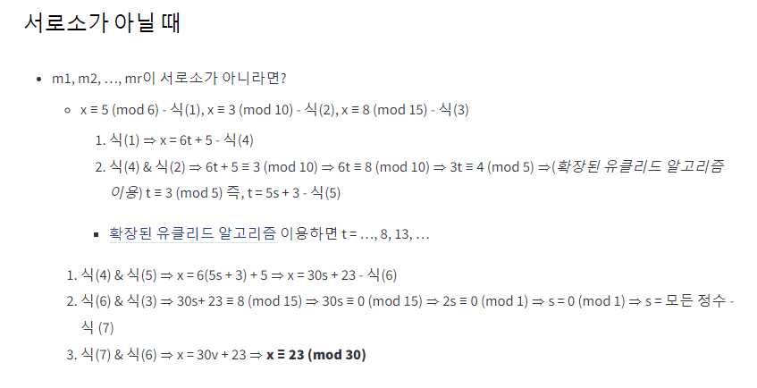

# 개요
## 문서 관리자
조승효(문서 생성자)
## 시작
   - 간혹가다 정수론을 이용해서 문제를 푸는 경우가 있을 수도 있다.
## 모듈러
   - 모듈러, 나머지 연산
   - 합동 등에 신경 쓰자

## 유클리드 호제법
   - 유클리드 호제법: 두 양의 정수 a, b (a > b) 에 대하여 a = bq + r (0 <= r < b) 이라 하면 a, b의 최대 공약수는 b, r의 최대공약수와 같다. 즉 gcd(a,b) = gcd(b,r) r = 0이라면 a,b 의 최대공약수는 b가 된다.
   - 확장된 유클리드 호제법을 이용해서 gcd(a,b) = d 라 할 때 ax + by = d를 만족하는 정수해 (x,y)를 구하려고 한다
## 중국인의 나머지 정리

   - 서로소인 n개의 수 각각에 대해 일정한 나머지를 만족하는 수는 그들 n개의 최소 공배수에 일정한 나머지를 더한 값으로 나타난다는 정리. 사실 어떤 자연수  A에 대해 일정한 나머지 B를 가지는 수에  A의 배수를 더하면 이 또한 A로 나눈 나머지가 B이므로, 존재성과 유일성을 증명하고 나면 n개 수의 최소공배수마다 조건을 만족하는 수가 반복되어 나타난다는 것은 쉽게 유추가 가능하다. 

   - 여기에서 "확장된 유클리드 알고리즘을 이용했다"는 것은 확장된 유클리드 알고리즘을 이용해서 3t 에서 3에 대한 역원을 구했다라고 이해하면 된다.
``` java
public static int extendedGCD(int a, int b, int[] xy) {
    if (a == 0) {
        xy[0] = 0;
        xy[1] = 1;
        return b;
    }
    int[] xy1 = {1, 1}; // To store results of recursive call
    int gcd = extendedGCD(b % a, a, xy1);
    xy[0] = xy1[1] - (b / a) * xy1[0];
    xy[1] = xy1[0];
    return gcd;
}

/*
* 중국인의 나머지 정리를 이용해서 특정 정수를 구하는 것
* 그 특정 정수를 t라고 하면
* t를 CRTPair[0].first으로 나누었을 때 나머지가 CRTPair[0].second
* t를 CRTPair[1].first으로 나누었을 때 나머지가 CRTPair[1].second
* ...
* t를 CRTPair[pairs.size()-1].first 으로 나누었을 때 나머지가 CRTPair[pairs.size() - 1]
* 을 동시에 만족하는 t를 리턴함. 
* 만약 만족하는 t가 없다면 -1을 리턴함.
*/
public static Integer chineseRemainderTheorem(ArrayList<CRTPair> pairs) {
    int a1 = pairs.get(0).second;
    int m1 = pairs.get(0).first;

    for (int i = 1; i < pairs.size(); i++) {
        int a2 = pairs.get(i).second;
        int m2 = pairs.get(i).first;
        int[] xy = {0, 0};
        int g = extendedGCD(m1, m2, xy);

        if ((a2 - a1) % g != 0) {
            return -1; // No solution exists
        }

        int m1_ = m1 / g;
        int m2_ = m2 / g;
        int mod = m1_ * m2_ * g;
        a1 = (a1 + xy[0] * (a2 - a1) / g % m2_ * m1) % mod;
        if (a1 < 0) a1 += mod;

        m1 = mod;
    }

    return a1;
}
```
에서
``` java
a1 = (a1 + xy[0] * (a2 - a1) / g % m2_ * m1) % mod;
```
이것은 도대체 뭘까 한번 증명해보자
x를 m1로 나눈 나머지를 a1, x를 m2로 나눈 나머지를 a2 라고 할 때 여기에서 정수 x를 구하고 싶다. 그렇다면 다음이 성립한다.

$x \equiv a1 \pmod {m1}$ 
$x \equiv a2 \pmod {m2}$ 
이다 여기에서
$x = m1 * t + a1 (t는 정수)$
라고 하자. 그렇다면
$m1 * t + a1 \equiv a2 \pmod {m2}$
이다. 이는
$m1 * t \equiv a2 - a1 \pmod {m2}$
로 표현할 수 있고 m1과 m2의 최대 공약수를 g라고 할 때 m1' = m1/g, m2' = m2/g 라고 표현하면
$m1' * t \equiv (a2 - a1) / g \pmod {m2'}$
여기에서 m1' 에 대한 역원을 p(코드 상에서는 확장된 유클리드 알고리즘으로 얻어낸 xy[0]) 라고 하면
$t \equiv p * (a2 - a1) / g \pmod {m2'}$
임을 알 수 있다. 이를 x에다가 대입하면
$x = m1 * (p * (a2 - a1) / g ) + a1$
로 한 가지로 표현할 수 있다.
코드상에서 m1_ * m2_ * g 는 m1 과 m2 의 최소 공배수임을 알도록 하자.
## 에라토스테네스의 체
   - 고대 그리스의 수학자 에라토스테네스가 만들어 낸 소수를 찾는 방법. 이 방법은 마치 체로 치듯이 수를 걸러낸다고 하여 '에라토스테네스의 체'라고 부른다.